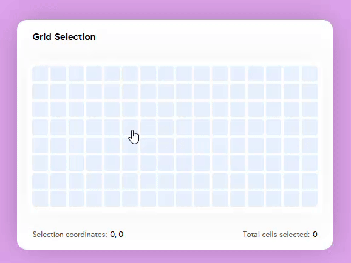

# Symbols Grid Selection
A flexible Grid Selection component designed with [DOMQL](https://github.com/domql/domql) and [smbls](https://github.com/symbo-ls/smbls). This component allows users to select a range of cells in a grid and dynamically updates based on user interaction.



## Setup

### Clone the repo
```bash
$ git clone https://github.com/leticia-chijo/symbols-grid-selection.git
```

### Install scripts
```bash
$ yarn
```

### Run the project
```bash
$ yarn start
```
